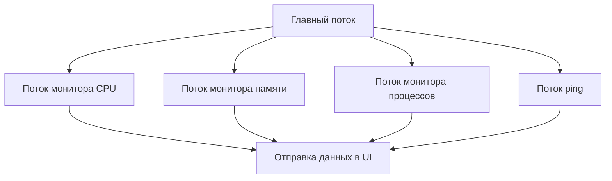
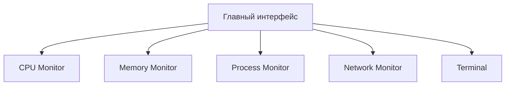

# System Monitor - Tauri Edition

 _Пример интерфейса приложения_

## 📌 О проекте

**System Monitor** - это современный мониторинг системы в стиле sci-fi, вдохновленный легендарным [eDEX-UI](https://github.com/GitSquared/edex-ui). Приложение сочетает в себе функциональность системного монитора с эстетикой голливудских хакерских интерфейсов.

Построено на:

- **Tauri** (Rust + WebView) - для нативной производительности
- **Svelte** - для реактивного интерфейса
- **sysinfo** (Rust) - для доступа к системным данным

## ✨ Особенности

✅ **Реальный мониторинг системы**:

- Использование CPU в реальном времени
- Динамика использования памяти (RAM)
- Список активных процессов
- Сетевая задержка (ping)

🎨 **Эстетика eDEX-UI**:

- Футуристичный терминал
- Зелено-черная цветовая схема
- Анимации и визуализации данных

⚡ **Технологии**:

- Многопоточный сбор данных (Rust)
- Реактивный интерфейс (Svelte)
- Нативная производительность (Tauri)

## 🛠 Установка и запуск

1. **Клонировать репозиторий**:

```bash
git clone https://github.com/yourusername/system-monitor-tauri.git
cd system-monitor-tauri
```

2. **Установить зависимости**:

```bash
npm install
```

3. **Запуск в режиме разработки**:

```bash
npm run tauri dev
```

4. **Сборка production версии**:

```bash
npm run tauri build
```

## 🖥 Компоненты системы

### 📊 Мониторы

- **CPU Monitor** - график загрузки процессора
- **Memory Monitor** - использование оперативной памяти
- **Process Monitor** - топ-10 процессов по нагрузке
- **Network Monitor** - сетевая задержка и статус

### 💻 Терминал

- Поддержка базовых команд (`help`, `clear`)
- История ввода/вывода
- Стилизация под хакерский интерфейс

## 🔧 Техническая реализация

### Backend (Rust)



### Frontend (Svelte)



## 📄 Лицензия

Этот проект распространяется под лицензией MIT. См. файл [LICENSE](LICENSE) для подробностей.

## 🙏 Благодарности

Особая благодарность создателям:

- [eDEX-UI](https://github.com/GitSquared/edex-ui) - за вдохновение
- [Tauri](https://tauri.app/) - за отличный фреймворк
- [Svelte](https://svelte.dev/) - за революционный подход к UI

---

**🚀 Наслаждайтесь мониторингом вашей системы в стиле киберпанк!**
